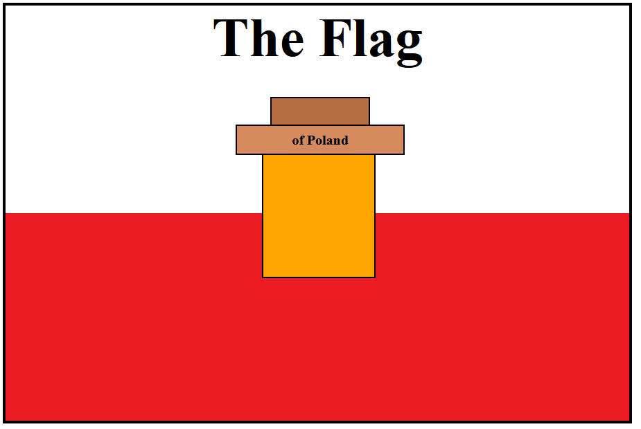

## CSS Flag of Poland

This project is a **CSS-only recreation** of the national flag of Poland, enhanced with a **house-shaped emblem** built using **pure HTML and CSS**. 
It is inspired by a classic front-end CSS exercise but extended with custom design elements and layout precision.

### Features

- **Inheritance-based CSS selectors**
- **Accurate flag proportions** (900×600)
- Custom emblem includes:
  - Orange base (house)
  - Brown roof with centered text
  - Chimney as a pseudo-element

### Educational Focus

This project demonstrates:
- Use of **CSS specificity and nesting**
- Mastery of `position: absolute` layout techniques
- Creative use of `::before` pseudo-elements
- Avoidance of div overuse by leveraging **semantic structure**

### File Structure

```
.
├── index.html     # Main HTML file with embedded CSS
└── README.md      # Project documentation
```

### Screenshot



### 🚀 How to Run

Just open the `index.html` file in your browser — no dependencies needed.
